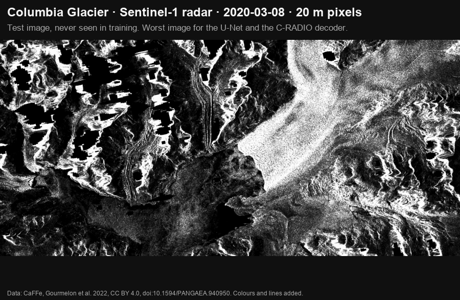
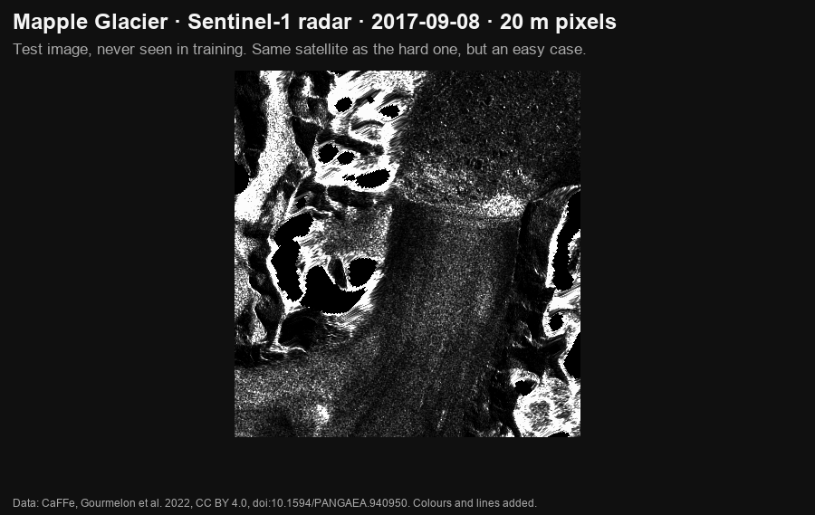
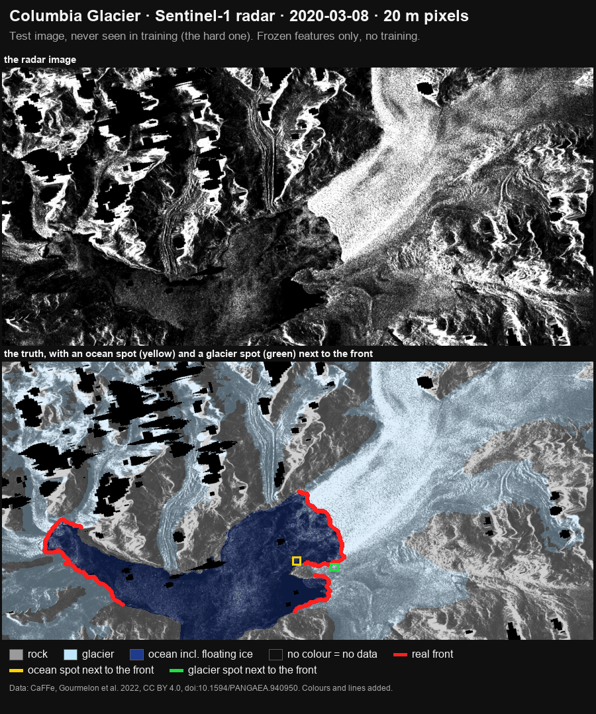
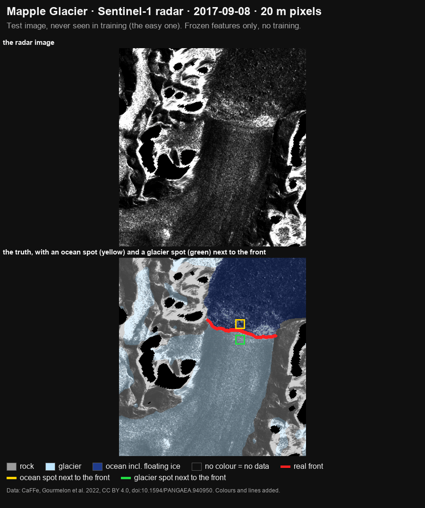

# sar-transfer-glaciers

**Do frozen encoders pretrained on optical satellite images transfer to SAR
images? And does that hold across radar bands?**

The test case is glacier calving-front delineation on the
[CaFFe](https://doi.pangaea.de/10.1594/PANGAEA.940950) benchmark. The pretrained
encoders stay frozen. We train only small probes and heads on top of them. A
U-Net trained from scratch is the reference.

Next to the satellite-pretrained DINOv3 (SAT-493M) we test encoders pretrained on
ordinary photos (DINOv3 LVD-1689M and C-RADIOv4-H) and two SAR-pretrained
encoders (TerraMind S1, SARATR-X). In most comparisons the photo-pretrained
encoders score as well as or better than the satellite one, but not in all
(see Results).

Full tables, methods, per-sensor and per-seed numbers and the long caveats are
in [docs/results.md](docs/results.md).

A follow-up that applies the same frozen pipeline to other SAR domains (glacial
lakes, snow, forests, alpine glaciers) is in preparation.

## How to read the numbers

- **SI** is the validation glacier (Sjögren-Inlet, 121 images). Layers and
  training settings were chosen on SI; nothing was tuned on TEST. Some choices
  came after a TEST run (see [Protocol](#protocol-what-was-decided-when)).
- **TEST** is the two test glaciers, Columbia (COL) and Mapple (122 images).
- **3-class patch mIoU** scores the zones (rock, glacier, ocean) per 16 px
  patch. Higher is better.
- **Paper-style IoU** scores the zones per image over 4 classes, including the
  "no information" class (NA), as in the CaFFe paper.
- **MDE** (mean distance error) is the distance between the predicted and the
  true calving front, in metres. Lower is better. An image where a model draws
  no front is left out of its MDE and counted as "no front". Always read the
  two together.
- **±** is the sample standard deviation (SD, n − 1) over three training seeds.
  For published numbers, ± is as reported by the source paper (the CaFFe
  baseline: 5 runs).

## Results

1. **Zones: a linear probe on frozen photo features scores like our U-Net on
   3-class patch mIoU.** On SI, C-RADIOv4-H with a linear probe scores 0.609 and
   the U-Net 0.590. On TEST, the photo DINOv3 probe scores 0.610, C-RADIO 0.602
   and the U-Net 0.594. On the paper-style 4-class IoU the probes trail: U-Net
   0.677, C-RADIO 0.636, photo DINOv3 0.613. They lose most on NA.
2. **The photo-pretrained encoders beat the two SAR-pretrained encoders we
   tried** by 0.20–0.26 3-class patch mIoU on SI and 0.22–0.25 on TEST. Both SAR
   models got inputs unlike their pretraining data. This is not a verdict on SAR
   pretraining in general.
3. **Fronts need more than a linear probe.** The probes draw no front on 30–57 %
   of TEST images. Their MDE is 2.1 to 2.9 times the U-Net's.
4. **Key TEST result: a small decoder on frozen C-RADIOv4-H features matches the
   U-Net on MDE. It does not beat it.** The 0.57 M-parameter decoder gives
   979 ± 31 m (three seeds). The 7.8 M-parameter U-Net gives 979 m (one run).
   Per glacier: COL 1,067 vs 1,080 m, Mapple 464 vs 474 m. The decoder misses
   more fronts: 7–9 of 122 images per seed, against 3 for the U-Net.
5. **SI did not predict TEST.** On SI both decoders led the U-Net clearly:
   C-RADIO by about 490 m, the satellite DINOv3 by about 400 m. On TEST the
   C-RADIO decoder only tied, and the satellite DINOv3 decoder was worse than
   the U-Net: 1,171 ± 292 m vs 979 m.
6. **Satellite pretraining gave no clear advantage.** With learned heads on
   TEST, C-RADIO and the satellite DINOv3 split 2–2: C-RADIO is better in rows 3
   and 5, the satellite DINOv3 in rows 4 and 6. With the same DINOv3 ViT-L/16
   and a last-layer probe, the photo model is better overall on TEST (zones
   0.610 vs 0.586; MDE 2,199 vs 2,805 m; 48 vs 60 images without a front). The
   satellite model is better on Mapple (526 vs 823 m) and on TerraSAR-X at 7 m
   (402 vs 892 m). The two MDEs are over different image subsets.
7. **AnyUp feature upsampling helps a linear probe draw fronts, not a learned
   head.** On TEST it lowers the front error of both encoders' probes (rows 1
   and 2 in the table below), but it also lowers their 4-class pixel mIoU. On SI
   it helped only C-RADIO's fronts and hurt the photo DINOv3's. Under a learned
   head it never beat C-RADIO's plain decoder. The
   satellite DINOv3's row 6 (1,076 m) lies inside the range of its row-3 seeds
   (985–1,508 m). A precision check (SI, inference only) found that running
   AnyUp in bf16 changes its output too little to matter.
8. **Seed spread showed up on TEST for the satellite DINOv3 decoder only.** Its
   SD was 25 m on SI and 292 m on TEST, where one seed reached 1,508 m with 11
   missed fronts. C-RADIO's decoder had SD 56 m on SI and 31 m on TEST.
9. **Band vs resolution is not settled.** In the first run (photo DINOv3,
   `per_tile` normalisation, SI), a line through the two C-band points (12 m and
   20 m) predicted the L-band score within 0.0005. Redone with each model's final SI run, it still roughly
   holds for C-RADIO (0.006 off) and less well for the photo DINOv3 (0.021 off). The satellite DINOv3, both SAR
   encoders and the U-Net score 0.08–0.24 below their own line on L-band (7
   PALSAR images). TEST cannot separate band, resolution and glacier.
10. **Everything here is far behind the published CaFFe models.** On all 122
    TEST images our best MDE is 979 m (the C-RADIO decoder over three seeds,
    and the U-Net; one decoder seed reached 945 m). The published CaFFe
    baseline reaches 753 ± 76 m, AMD-HookNet 438 ± 22 m and HookFormer
    353 ± 16 m. Per glacier, our best single results are COL 1,029 m
    and Mapple 324 m; the baseline reaches 840 ± 84 m and 150 ± 24 m (see
    [Published results](#published-results-on-the-same-test-images)).
11. **Negative result:** Cosmos-Reason2-8B could not judge calving-front change
    in SAR image pairs.
12. **Telling the decoder each image's band and pixel size had no clear effect**
    (approach A, exploratory, SI only). The conditioned decoder's mean MDE was
    59 m lower for the satellite DINOv3 and 74 m lower for C-RADIO, both inside
    the seed spread, so by the rule fixed beforehand there is no clear effect.
    Its largest per-sensor gains were on L-band, which is only 7 SI images.
13. **Which training tiles a decoder sees matters more than the seed.**
    Retrained on a uniform tile sample, the plain row-3 decoder scored
    1,434 ± 38 m (satellite DINOv3) and 1,581 ± 42 m (C-RADIO) on SI. The
    reported heads, trained on the tilted sample, scored 1,329 ± 25 m and
    1,244 ± 56 m. So the seed SDs understate how uncertain the arm-2 numbers are.
    The TEST run used the reported heads and was not repeated.

### Fronts: every head on SI and TEST (MDE in m, no-front count in brackets)

| head | C-RADIOv4-H, SI | C-RADIOv4-H, TEST | DINOv3 SAT, SI | DINOv3 SAT, TEST |
|---|---|---|---|---|
| 1 linear probe on the 16 px grid | 1,791 (6) | 2,115 (38) | 1,853 (2) | 2,660 (42) |
| 2 AnyUp + linear probe | 1,534 (5) | 1,915 (21) | 1,849 (0) | 2,083 (36) |
| 3 decoder, 3 seeds | 1,244 ± 56 (0) | **979 ± 31** (7–9) | 1,329 ± 25 (0) | 1,171 ± 292 (2–11) |
| 4 AnyUp at full resolution + light head | 1,445 (0) | 1,316 (17) | 1,402 (0) | 1,226 (7) |
| 5 decoder on 4 layers | 1,345 (0) | 1,005 (2) | 1,465 (0) | 1,249 (7) |
| 6 AnyUp to 1/4 + decoder | 1,375 (0) | 1,225 (12) | 1,384 (0) | 1,076 (1) |
| U-Net from scratch, one run | 1,732 (0) | 979 (3) | | |

### Frozen encoders with a linear probe on TEST

| model | 3-class patch mIoU | paper-style IoU | MDE (m) | no front / 122 |
|---|---|---|---|---|
| U-Net from scratch | 0.594 | **0.677** | **979** | 3 |
| DINOv3 photo (LVD-1689M) | **0.610** | 0.613 | 2,199 | 48 |
| C-RADIOv4-H | 0.602 | 0.636 | 2,089 | 37 |
| DINOv3 SAT (SAT-493M) | 0.586 | 0.595 | 2,805 | 60 |
| TerraMind 1.0 base, S1 | 0.385 | 0.389 | 2,414 | 55 |
| SARATR-X v1 | 0.363 | 0.438 | 2,796 | 70 |
| published CaFFe baseline | | 0.79 | 753 (COL 840, Mapple 150) | 1 ± 1 |

The U-Net column uses two separate U-Nets: a 3-class one for the patch mIoU
and a 4-class one for the paper-style IoU and the fronts.

### Published results on the same TEST images

Taken from the papers, not re-run. MDE on all 122 TEST images.

| model | zone IoU, 4 classes incl. NA | MDE (m) | no front / 122 | source |
|---|---|---|---|---|
| CaFFe baseline | 0.79 ± 0.02 | 753 ± 76 (COL 840 ± 84, Mapple 150 ± 24) | 1 ± 1 | CaFFe paper, Table 5 (IoU, per glacier); AMD-HookNet paper, Table III (all images) |
| AMD-HookNet | 0.744 ± 0.010 | 438 ± 22 | 0 ± 1 | AMD-HookNet paper, Table III; IoU from AMD-HookNet++, Table III |
| HookFormer (TGRS 2024) | 0.755 ± 0.003 | **353 ± 16** | 0 | AMD-HookNet++ paper, Table III |
| AMD-HookNet++ | **0.782 ± 0.004** | 367 ± 30 | 0 | AMD-HookNet++ paper, Table III |

- HookFormer has the best published MDE in this comparison. AMD-HookNet++
  leads on IoU; its own paper calls its MDE 4.0 % worse than HookFormer's.
- The AMD-HookNet++ paper prints IoU in per cent (78.2). Its per-class table
  shows that this is the unweighted mean of the four zone classes including NA.
- The official CaFFe evaluation leaves an image without a predicted front out
  of the MDE and counts it, as we do. AMD-HookNet uses the same rule.

Related work: Cryo-Bench (Hugging Face dataset `Sk-21/Cryo-Bench`, checked
2026-09-27) also runs frozen geospatial foundation models (among them Prithvi,
TerraMind, DOFA and CROMA) with a UPerNet decoder on CaFFe, and references the
PANGAEA benchmark (Marsocci et al.). Its paper was in review when checked, so its
numbers are not compared here. Its encoders differ from ours (no DINOv3, no
C-RADIO).

## Seeing the results

Two TEST images, never seen in training. Each GIF steps through the radar
image, the true zones and front, the predictions of the U-Net, the C-RADIO
probe, the C-RADIO decoder and the satellite DINOv3 decoder, and all fronts
together.



Hard case: Columbia Glacier, Sentinel-1, 2020-03-08, one of the 18 images of
the next section.



Easy case: Mapple Glacier, Sentinel-1, 2017-09-08.

Radar images and labels: CaFFe (Gourmelon et al. 2022), CC BY 4.0,
https://doi.org/10.1594/PANGAEA.940950. Colours and lines added.

Notebook 10 collects the 243 scored SI and TEST images with every run's
per-image results, notebook 11 redraws the saved TEST predictions of these four
models (identical to the saved results on 122 of 122 images each),
notebooks 12 and 13 are the pixel-size checks below, and notebook 14 looks at
the frozen features of these two images without training (below).
`scripts/view_results.py` opens the results in the FiftyOne viewer on your own
PC (nothing is uploaded), and `scripts/make_gifs.py` makes the GIFs from the
same files.

## Where the test error comes from

Added after every TEST run, from the saved per-image results (notebook 11). It
describes the test set after the fact and changes no choice. Every model, the
U-Net included, does far worse on the 18 Sentinel-1 images of Columbia (15 % of
the 122 TEST images) than on the rest. Over all 22 saved TEST runs these images
hold 7–14 % of the pooled front distances but 15–38 % of the summed error.

| TEST MDE (m) | all 122 images | without the 18 | the 18 only |
|---|---|---|---|
| U-Net, 4-class | 979 | 730 | 3,447 |
| C-RADIO decoder, seeds 0 / 1 / 2 | 945 / 1,003 / 990 | 671 / 735 / 732 | 2,914 / 2,808 / 2,816 |
| satellite DINOv3 decoder, seeds 0 / 1 / 2 | 1,021 / 1,508 / 985 | 809 / 1,270 / 773 | 2,447 / 3,294 / 2,339 |
| C-RADIO probe (arm 1) | 2,089 | 1,809 | 4,808 |

The key result holds with and without these images: the C-RADIO decoder
matches the U-Net and does not beat it. Shares of the error and no-front counts
per run are in [docs/results.md](docs/results.md#where-the-test-error-comes-from).

## Pixel size or radar band?

Exploratory, SI only, after every TEST run; the rules were written down before
any number (notebooks 12 and 13). In CaFFe each band comes with its own pixel
sizes, so we shrank SI images to coarser pixels and ran the saved models on
them, unchanged. On the original images every head first reproduced its saved
SI result exactly. The U-Net's saved SI file cannot be reproduced bit for bit,
so all its numbers here were rerun on one path.

- **X-band, 7 m → 20 m** (32 TerraSAR-X images). Rule:
  r = (X@20 − X@7) / (C@20 − X@7), with C@20 the real SI C-band images at
  20 m. r ≥ 0.5 means pixel size explains the X-vs-C difference; if
  |C@20 − X@7| is under 100 m there is nothing to explain (–).
- **C-band, 12 m → 20 m** (21 RADARSAT-1 images, same band and satellite).
  Rule: pixel size hurts if the pooled MDE is at least 100 m worse at 20 m.

| SI pooled MDE (m) | X@7 | X@20, shrunk | C@20, real | r | C 12 m → 20 m, shrunk |
|---|---|---|---|---|---|
| C-RADIO probe | 1,821 | 2,497 | 2,060 | 2.83 | 1,446 → 1,771 |
| C-RADIO decoder, seeds 0 / 1 / 2 | 1,158 / 1,092 / 1,233 | 1,710 / 1,289 / 1,373 | 1,497 / 1,302 / 1,409 | 1.63 / 0.94 / 0.79 | 1,309 → 1,523; 1,330 → 1,385; 1,153 → 1,223 |
| satellite DINOv3 probe | 1,901 | 5,367 (5 no front) | 1,893 | – | 1,514 → 1,870 |
| satellite DINOv3 decoder, seeds 0 / 1 / 2 | 1,247 / 1,313 / 1,282 | 2,138 / 1,875 / 1,842 | 1,422 / 1,386 / 1,495 | 5.08 / – / 2.63 | 1,069 → 1,377; 1,168 → 1,525; 1,125 → 1,430 |
| U-Net, 4-class, all rerun | 1,864 | 2,450 (1 no front) | 1,223 | −0.91 | 1,741 → 1,755 |

- **Coarser pixels hurt every model from 7 m to 20 m**: all 9 rows got worse.
- **On SI, the X-band advantage over C-band is explained by pixel size** for 6
  of 9 rows; 2 rows had no difference to explain. The U-Net is the exception:
  it was already worse on X-band at 7 m than on C-band at 20 m (r = −0.91).
- **Within C-band, 12 m → 20 m hurts 6 of 9 rows** (at least 100 m worse):
  both probes, every satellite DINOv3 decoder seed and C-RADIO decoder seed 0.
  The U-Net changes by +14 m.
- **No consistent band ranking** in the saved per-glacier, per-band results,
  and no evidence that X-band itself helps. L-band is only 7 SI and 8 TEST
  images.
- **Caveats.** A shrunk image is not a real 20 m product. X-band at 20 m is a
  combination no model saw in training, so ending up worse than real C-band
  (r above 1) may be unfamiliarity, not band physics. Band stays mixed with
  satellite, years and scene. SI only, one glacier. Exploratory; it changes no
  earlier choice.

Full tables, the per-band table and all caveats are in
[docs/results.md](docs/results.md#pixel-size-or-radar-band).

## What the frozen features look like (notebook 14)

Descriptive, after every TEST run: it looks at the two TEST images of the GIFs
above, trains nothing and changes no result. Notebook 14 shows the frozen
features directly, with no probe or decoder, raw and after AnyUp at 1/4
resolution. The AUC says how well the distance to the image's ocean and glacier
centres tells ocean from glacier patches (1 = fully apart, 0.5 = not at all);
the shares are the classes of the 100 patches most similar to the ocean patch
next to the front.

| Columbia, Sentinel-1 (hard) | AUC ocean vs glacier, raw / AnyUp 1/4 | ocean query, top 100: ocean / glacier |
|---|---|---|
| C-RADIO | 0.935 / 0.947 | 0.86 / 0.04 |
| satellite DINOv3 | 0.872 / 0.922 | 0.77 / 0.09 |
| photo DINOv3 | 0.737 / 0.738 | 0.66 / 0.09 |

Mapple (easy), same order: AUC raw 0.999 / 0.990 / 0.975, AnyUp 1/4 0.999 /
0.999 / 0.977.

Every encoder separates ocean from glacier much worse on the Columbia image
than on Mapple. Looking at Columbia's Sentinel-1 images, whose large errors are
described in [Where the test error comes from](#where-the-test-error-comes-from),
had led to a hypothesis: ice mélange in front of the glacier that looks like
glacier to the encoders. Notebook 14 does not support it at the tested spot:
the ocean patch next to the front looks like ocean to every encoder. Caveats:
descriptive, one image per glacier and one query patch per class; the centres
come from each image's own labels, so the AUCs are optimistic. Details in
[docs/results.md](docs/results.md#frozen-features-without-training-notebook-14).



Hard case: Columbia Glacier, Sentinel-1, 2020-03-08. The GIF steps through the
radar image and the truth with the two query spots, then per encoder the
feature colours and what looks like the ocean spot (raw, then AnyUp 1/4), a
zoom at the front and the numbers.



Easy case: Mapple Glacier, Sentinel-1, 2017-09-08.

Radar images and labels: CaFFe (Gourmelon et al. 2022), CC BY 4.0,
https://doi.org/10.1594/PANGAEA.940950. Colours and lines added.
`scripts/make_embedding_gifs.py` makes these two GIFs from the files notebook
14 saves on Drive.

## Protocol: what was decided when

- SI was taken out of the official training set as the validation glacier
  before any modelling. Layers and training settings were chosen on SI;
  nothing was tuned on TEST.
- Each set of models was scored on the test glaciers once and not changed
  afterwards.
- Arm 1 (frozen encoders with a linear probe, plus the U-Net) was scored on
  TEST on 2026-09-24.
- Arm 2 (learned heads) was designed after arm 1's TEST run, because that run
  showed the probes fail at fronts. The switch of the study's DINOv3 from the
  photo model to the satellite model was also decided after that run. Arm 2's
  protocol was written down before any arm-2 result. Rows 5 and 6 were added
  after reading the SI table of rows 1–4, before any arm-2 TEST run.
- Arm 2 was scored on TEST once, on 2026-09-25, by loading the saved heads. The
  satellite DINOv3 probe was scored on TEST once, the same evening. The photo
  DINOv3 heads never went to TEST.
- After arm 2's TEST run we ran a bf16 precision check on SI and fixed the code
  ([Reproduction](#reproduction-the-code-changed-after-the-reported-runs)).
  Neither changed a reported number. We also added approach A
  (`notebooks/09_conditioning.ipynb`, band and resolution conditioning of the
  row-3 decoder). It is exploratory and SI only; results in
  [docs/results.md](docs/results.md#approach-a-band-and-resolution-conditioning).
- Decisions were logged with dates while the work ran; they are summarised
  here and in [docs/results.md](docs/results.md).

## Setup

### Data: CaFFe

681 SAR images, 8-bit, single channel, from 7 glaciers, at 6–20 m ground
resolution, taken 1995–2020 by seven SAR missions. Zone labels: NA, rock,
glacier, ocean with ice mélange. Front labels are 1 px lines. Licence CC BY 4.0.

| split | glaciers (images) | images |
|---|---|---|
| train | Crane 69, DBE 133, JAC 159, Jorum 77 | 438 |
| validation | SI 121 | 121 |
| TEST | COL 65, Mapple 57 | 122 |

| band | sensors | all images | SI | TEST |
|---|---|---|---|---|
| X | TerraSAR-X, TanDEM-X | 395 | 32 | 69 |
| C | ENVISAT, ERS-1/2, RADARSAT-1, Sentinel-1 | 238 | 82 | 45 |
| L | ALOS PALSAR | 48 | 7 | 8 |

- The official split is 559 training and 122 test images. We took SI (five
  sensors, all three bands) out of the training set. The band of each sensor
  is as listed in the CaFFe paper (Table 2).
- TEST is 94.8 % X-band patches (1,745,537 of 1,841,326). Every TEST X image is
  at 7 m and every C image at 20 m. The 8 L-band TEST images are all on Mapple.
- Band is confounded with glacier. JAC (159 of 438 training images, 36 %) is all
  TerraSAR-X. COL is only Sentinel-1 and TanDEM-X.

### Encoders (all frozen)

| key | model | pretraining data | parameters |
|---|---|---|---|
| `cradio-v4-h` | `nvidia/C-RADIOv4-H`, revision `0057b339059c` | photos; agglomerative, distilled from several teachers: SigLIP2-g, DINOv3-7B, SAM3 (model card: NV-CC-Img-Text-Dataset, 700 M images) | 651.6 M as loaded |
| `dinov3-l-sat` | `facebook/dinov3-vitl16-pretrain-sat493m` | SAT-493M: 493 M Maxar RGB images at 0.6 m (model card) | 303.1 M as loaded |
| `dinov3-l-photo` | `facebook/dinov3-vitl16-pretrain-lvd1689m` | LVD-1689M: 1,689 M curated web images (model card) | 303.1 M in the weight file |
| `terramind-v1-base-s1` | `ibm-esa-geospatial/TerraMind-1.0-base` via terratorch | TerraMesh: 9 M aligned samples of 264×264 px at 10 m, 500 B tokens; Sentinel-1 GRD or RTC, Sentinel-2, DEM, land cover, NDVI, coordinates, captions (model card and paper) | 465.0 M is the file count of the whole multimodal checkpoint; the S1 encoder was not counted; the model card and paper state no count |
| `saratrx-v1` | `waterdisappear/SARATR-X`, `checkpoint-800.pth` | SARDet-180K (paper): 186,600 unlabelled SAR target chips from 14 public datasets; vehicles, ships, aircraft and other targets such as oil tanks and bridges; satellite, airborne and simulated; about 0.1–25 m per dataset | 65.8 M as run (our own HiViT port) |

- The satellite DINOv3 replaced the photo DINOv3 as the study's DINOv3. Both
  are the same ViT-L/16; only the pretraining data differs. The photo model's
  results are kept as a matched pair. The "ordinary photos" claim now rests on
  C-RADIOv4-H.
- SARATR-X v2 was left out by decision: its paper was under review, its weights
  were available by e-mail request only, and Hugging Face returned 403 for our
  token.
- Input: the grey image copied to 3 channels, each model's own preprocessing
  bypassed, 512 px tiles. The heads, the U-Net and every front and TEST result
  use `caffe` normalisation (the official CaFFe statistics); SARATR-X gets
  `unit` (pixel / 255), what it saw in pretraining. For the zone probes,
  `per_image` z-scoring changed the score by less than 0.01, except TerraMind
  (0.013). TerraMind expects VV and VH in dB; we copy the single CaFFe channel
  into both.

### The six heads of arm 2

Trainable parameters. For rows 4 and 6 this is the count that gets gradients
(the counts printed at run time are in [docs/results.md](docs/results.md)).

| row | head | DINOv3, 1024-d | C-RADIOv4-H, 1280-d |
|---|---|---|---|
| 1 | linear probe on the 16 px grid, logits upsampled bilinearly | 4,100 | 5,124 |
| 2 | AnyUp → per-pixel features → linear probe | 4,100 | 5,124 |
| 3 | `GridDecoder`: 1×1 reduction, four ×2 upsampling stages, image skip at 5 scales | 544,388 | 568,964 |
| 4 | `PixelHead`: 1×1 reduction → AnyUp at full resolution → image map → 2 convs | 114,452 | 130,836 |
| 5 | row 3 on 4 concatenated layers (DINOv3 6+12+18+24, C-RADIO 8+16+24+32) | 839,300 | 937,604 |
| 6 | `AnyUpDecoder`: AnyUp to 1/4 resolution → the last 3 stages of row 3 | 239,652 | 264,228 |

Layers were chosen on SI by a zone proxy: C-RADIO layer 32, satellite DINOv3
layer 21, photo DINOv3 layer 18.

Rows 3–6 train for 4,000 steps with AdamW (learning rate 1e-3, weight decay
1e-4), a OneCycle schedule, batch 8 (row 4: 4), class-balanced cross-entropy and
horizontal flips, on at most 4,000 training tiles (row 5: 2,000). No checkpoint
was picked on SI. The linear probes, the U-Net (48,000 iterations, one run) and
the exact metric definitions are in [docs/results.md](docs/results.md#methods).
In short: patch mIoU and 4-class pixel mIoU pool one confusion matrix over the
split, paper-style IoU is averaged per image, and MDE pools the distances over
all images, as the official code does.

## Caveats

- **Our U-Net is weaker than the published one**: paper-style IoU 0.677 vs 0.79,
  MDE on all TEST images 979 vs 753 m, COL 1,080 vs 840 m and Mapple 474 vs
  150 m.
- **The SAR encoders got mismatched inputs.** TerraMind got one channel copied
  twice. SARATR-X was pretrained on small target chips, not glacier scenes.
- **The training tiles of the reported rows 3–6 were not a uniform sample**, and
  **the seed did not set the reported heads' initial weights.** Every encoder
  saw the same tiles, so the comparisons stay fair. A reported head can only be
  recreated from its saved weights. Retrained on a uniform sample, row 3 scored
  about 100 m (satellite DINOv3) and 340 m (C-RADIO) worse on SI, so arm-2
  results depend on the tile sample more than the seed SDs show.
- **Rows 2, 4, 5 and 6 are not controlled ablations of row 3.** Row 5 used 2,000
  tiles and 4× the input width. Row 4 has about 1/5 of row 3's parameters.
- **Small groups.** L-band is 7 SI images and 8 TEST images (all on Mapple).
  RADARSAT-1 at 20 m is 6 SI images. ERS on Mapple is 2 images.
- **One dataset, no confidence intervals** except the row-3 seed SDs.
- More in [docs/results.md](docs/results.md#caveats-in-full).

## Negative result: Cosmos-Reason2-8B

`nvidia/Cosmos-Reason2-8B` was asked whether a calving front advanced or
retreated between two SAR images of the same glacier (56 pairs, half advances).
The two direct setups answered "retreat" for all 56. The two reasoning setups
gave a few "advance" answers (advance recall 0.11 and 0.14) and did no better
than chance. No evidence that it can judge calving-front change in SAR; the arm
was closed at 8B ([details](docs/results.md#negative-result-cosmos-reason2-8b)).
The code of this closed arm is not part of this repository.

## How to run

The notebooks are written for VS Code with the Google Colab extension: open a
notebook locally, connect it to a Colab runtime, and the cells run there. The
runtime cannot see your local disk, so the code travels inside one notebook
cell, the sync cell. Nothing is cloned on the runtime.

```
python sync.py            # pack src/sartransfer/**/*.py and pyproject.toml into every notebook
python sync.py --check    # list stale notebooks, exit 1 if any (an empty sync cell counts as stale)
python sync.py --clear    # empty the sync cells again, before committing
```

1. Clone this repository to your own machine and run `python sync.py` in its
   folder. No install is needed for this step.
2. Open the notebooks in VS Code with the Colab extension. If you use the Colab
   website instead, upload the synced notebooks, and upload them again after
   any code change.
3. On Hugging Face, with the account that owns your `HF_TOKEN`, get access to
   three gated models. Accept the DINOv3 licence on both
   `facebook/dinov3-vitl16-pretrain-lvd1689m` and
   `facebook/dinov3-vitl16-pretrain-sat493m`. Access is granted per model and
   approved by hand, which can take time. Accept the contact-info gate on
   `waterdisappear/SARATR-X`. C-RADIOv4-H and TerraMind are not gated. Without
   access, the download fails with error 403 and the notebooks print FAILED
   for that model.
   Copy `.env.example` to `.env`, fill in `HF_TOKEN` (a read token is
   enough), and put the file at `MyDrive/sar-transfer/.env` on Google Drive.
   Without it, the code asks for the token with `getpass`.
4. Mount Drive (`Colab: Mount Google Drive to Server…`) and run notebooks 00
   to 09 in order, on the runtime given in the table. Notebooks 10 to 14 are
   optional. 10 to 13 use what 00 to 09 saved on Drive; 14 needs only the
   CaFFe zip and the model weights, which it downloads if missing.

The published notebooks have empty sync cells. An empty cell stops the
notebook with a message that says to run `python sync.py`, so it cannot run
old code. Run `python sync.py` after every code edit. Commit notebooks with
empty sync cells: the code belongs in `src/` once. `sync.py` prints a source
fingerprint locally, and the sync cell prints it again on the runtime; if the
two differ, the runtime is running old code.

Use an A100 with High-RAM. On SI, the row-5 extraction printed "RAM used 67 of
179 GB" (satellite DINOv3) and 80 of 179 GB (C-RADIO). Earlier runs, on a
runtime whose RAM was not printed, stopped three times without a Python error;
memory was suspected but not confirmed.

| notebook | runtime | time recorded (A100) | what it does |
|---|---|---|---|
| `00_setup` – `02_tiling` | CPU | not recorded | runtime and secrets check; download and measure CaFFe; tiling check |
| `03_encoders` | GPU | 43 min for the first loop | zone probe per encoder and normalisation, on SI |
| `04_compare` | any | not recorded | compares encoders per band, sensor and resolution |
| `05_unet` | GPU | 19.9 min (A100-40GB) | 3-class U-Net from scratch |
| `06_fronts` | GPU, High-RAM | 22 min for the four encoders | 4-class U-Net and probe fronts on SI |
| `07_test` | GPU, High-RAM | encoders 25 min, U-Nets about 5 min, satellite DINOv3 probe 6.5 min | arm 1 on TEST (run once) |
| `08_heads` | GPU, High-RAM | layer sweep 13–14 min per encoder; heads on SI 51–110 min per run, about 4.8 h in total; heads on TEST about 1.5 h | arm 2: layer sweep, heads on SI, heads on TEST (run once), precision check |
| `09_conditioning` | GPU, High-RAM | 43 min (satellite DINOv3), 49 min (C-RADIO) | approach A, exploratory, SI only |
| `10_fiftyone` | CPU | not recorded | FiftyOne dataset of the per-image results, zipped to Drive for `scripts/view_results.py` |
| `11_predictions` | GPU | redraw about 5 min; RAM used 12 of 179 GB | share of the TEST error from COL Sentinel-1; copy-back speed check; redraws four models' TEST predictions |
| `12_resolution` | GPU, A100 only | 9.6 min | pixel size, SI only: X-band 7 m → 20 m |
| `13_bands` | GPU, A100 only | part 2: 5.7 min | every band from the saved results; pixel size within C-band, SI only: 12 m → 20 m |
| `14_embeddings` | GPU, A100, standard RAM | 7.2 min | frozen features of the two GIF images, no training: embedding maps, similarity search, ocean-vs-glacier AUC, raw and AnyUp |

The times come from the reported runs. Head training in 08 and 09 was sped up
afterwards (identical weights in a CPU test); the new times were not measured.
Per-step times are in [docs/results.md](docs/results.md#run-times).

What the notebooks keep on Google Drive:

```
MyDrive/sar-transfer/
  .env                              secrets, never in git
  raw/data_raw.zip                  CaFFe zip, downloaded once
  results/                          result CSVs, saved heads (heads__*.pt), U-Net weights
  weights/anyup_multi_backbone.pth  AnyUp weights, downloaded if missing
  hf_cache/                         Hugging Face model cache
  fiftyone/                         sar-transfer-results.zip, FiftyOne dataset (notebook 10)
  predictions/                      sar-transfer-predictions.zip, redrawn TEST predictions (notebook 11)
  resolution_test/                  restest_*.csv, pixel-size and band tables (notebooks 12-13)
  embeddings/                       figures, embeddings_numbers.csv, embeddings_gif_<stem>.npz (notebook 14)
```

### Faster feature copy-back

The encoder output is now cast to float16 on the GPU before it is copied to the
CPU. On an A100 (notebook 11, 298 tiles per encoder) the copy-back fell from
9.3 to 1.2 ms per tile for C-RADIO (layer 32; forward 10.4 ms) and from 7.8 to
1.2 ms for the satellite DINOv3 (layer 21; forward 7.8 ms). The encoder pass is
41–42 % faster, and the features are bit-identical, so no reported number
changes. The reported runs, and their recorded times, used the old path.

### Reproduction: the code changed after the reported runs

The reported numbers come from the saved heads and the result CSVs on Drive.
Neither is in git. After the reported runs the code was fixed:

- **Tile sampler:** uniform by default; `legacy_tile_sampler=True` recovers the
  reported tile set.
- **Seed:** now set before each head is built.
- **Lean image stems:** rows 4 and 6 build only the stem levels they use.
  `load_head_state` loads the old heads. In an offline CPU test, heads trained
  by the old code gave byte-identical test CSVs with the new code. The reported
  heads themselves were not re-scored, and CUDA was not tested.
- **TEST loading** no longer extracts the training images.
- **Code-review fixes of 2026-09-27** (none changes a reported number): a
  broken download of the CaFFe zip is resumed instead of reused; the `.env`
  line-break check; the remote-code check covers subfolders; U-Net log loss of
  a short last window; conditioning verdict with one seed; one prediction pass
  for the 3-class U-Net test; head training reuses its training data across
  heads; one class-weight function; two leftovers removed.
- **After the final review of 2026-09-28** (none changes a reported number):
  notebook 06 prints its IoU table with three decimals (the saved output has
  one); `heads.summary_table` takes the zones4 "all" row from the first
  grouping, as the run code does (the "all" rows are equal in every grouping).

Retraining gives different heads, even with `legacy_tile_sampler=True`,
because the initial weights are now seeded. Recorded software: Python 3.13.15,
torch 2.11.0+cu128. The versions of transformers, timm, terratorch and the
other libraries were not recorded; runtime pip installs are unpinned.

## Security and provenance

- Third-party models only run inference. Every `torch.load` in `src/` uses
  `weights_only=True`; the DINOv3 and C-RADIO weights are safetensors; the
  pickled checkpoints were scanned without running them.
- C-RADIO's remote code is pinned to revision
  `0057b339059c0b9e1b4ba996f975410ebbfdfcc8`, and its 26 Python files are
  SHA-256-checked against a reviewed copy before loading. C-RADIO runs made
  before the pin was added ran unpinned remote code.
- AnyUp's inference code is vendored. Its weights come from the authors' GitHub
  release if missing on Drive and are checked by size and full SHA-256.
- The CaFFe zip has no checksum. DINOv3, SARATR-X and TerraMind load without a
  revision pin. Runtime pip installs are unpinned. See
  [docs/results.md](docs/results.md#provenance-what-the-code-fetches).
- The `weights_only` rule, the C-RADIO pin and hash table, the `.env` parser,
  the empty sync cells and a secret scan are tested in CI on every push and
  pull request (`.github/workflows/ci.yml`), together with ruff and `compileall`.

## Licences

| component | licence | use here |
|---|---|---|
| this repository | MIT, see `LICENSE` (Copyright (c) 2026 Abhishek Singh) | everything except `src/sartransfer/models/anyup/` |
| `src/sartransfer/models/anyup/` | CC BY 4.0, third-party code (LICENSE and NOTICE.md in the folder) | vendored AnyUp inference code |
| AnyUp weights | no separate licence is stated by the source; the AnyUp repository's only licence is CC BY 4.0 | downloaded at run time |
| CaFFe dataset | CC BY 4.0 | downloaded at run time |
| CaFFe official code | CC BY 4.0 | not copied; `fronts.py` and `tiling.py` reimplement its evaluation route and use its normalisation constants |
| DINOv3 ViT-L/16, LVD-1689M and SAT-493M | DINOv3 License (Meta), gated with manual approval | downloaded at run time; publications must acknowledge the use of DINOv3 |
| C-RADIOv4-H weights | NVIDIA Open Model License Agreement (the June 2024 version linked from the model card); not gated | downloaded at run time |
| C-RADIOv4-H remote code | 20 of its 26 Python files carry an NVIDIA proprietary notice, 2 an Apache-2.0 notice | not in this repository; only SHA-256 values are stored |
| TerraMind 1.0 base | Apache-2.0 (model card metadata) | downloaded at run time |
| terratorch | Apache-2.0 up to release 1.2.7; "Apache-2.0 AND MIT" from 1.2.8 (May 2026), with MIT for four dataset files. The installed version was not recorded | installed at run time |
| SARATR-X v1 | CC BY-NC 4.0, non-commercial, on both the Hugging Face model card and the GitHub repository; gated | downloaded at run time |
| Cosmos-Reason2-8B | NVIDIA Open Model License; the model card adds "Additional Information: Apache License 2.0"; gated | closed arm; code not in this repository |

No weights or data are redistributed here. This work uses DINOv3 by Meta.

## Citations

Data and benchmark:

- Marsocci, V., Jia, Y., Le Bellier, G., et al.: PANGAEA: A Global and Inclusive
  Benchmark for Geospatial Foundation Models, arXiv:2412.04204, 2024.
- Cryo-Bench, Hugging Face dataset Sk-21/Cryo-Bench,
  https://huggingface.co/datasets/Sk-21/Cryo-Bench (accessed 2026-09-27).
- Gourmelon, N., Seehaus, T., Braun, M., Maier, A., and Christlein, V.:
  Calving fronts and where to find them: a benchmark dataset and methodology
  for automatic glacier calving front extraction from synthetic aperture radar
  imagery, Earth Syst. Sci. Data, 14(9), 4287–4313,
  https://doi.org/10.5194/essd-14-4287-2022, 2022.
- Gourmelon, Nora; Seehaus, Thorsten; Braun, Matthias Holger; Maier, Andreas;
  Christlein, Vincent (2022): CaFFe (CAlving Fronts and where to Find thEm: a
  benchmark dataset and methodology for automatic glacier calving front
  extraction from sar imagery) [dataset]. PANGAEA,
  https://doi.org/10.1594/PANGAEA.940950.
- CaFFe code: https://github.com/Nora-Go/Calving_Fronts_and_Where_to_Find_Them

Published CaFFe models:

- Wu, F., Gourmelon, N., Seehaus, T., Zhang, J., Braun, M., Maier, A., and
  Christlein, V.: AMD-HookNet for Glacier Front Segmentation, IEEE
  Transactions on Geoscience and Remote Sensing, 61, 1–12,
  https://doi.org/10.1109/TGRS.2023.3245419, 2023. arXiv:2302.02744.
- Wu, F., Gourmelon, N., Seehaus, T., Zhang, J., Braun, M., Maier, A., and
  Christlein, V.: Contextual HookFormer for Glacier Calving Front
  Segmentation, IEEE Transactions on Geoscience and Remote Sensing, 62, 1–15,
  https://doi.org/10.1109/TGRS.2024.3368215, 2024.
- Wu, F., Dreier, M., Gourmelon, N., Wind, S., Zhang, J., Seehaus, T., Braun,
  M., Maier, A., and Christlein, V.: AMD-HookNet++: Evolution of AMD-HookNet
  With Hybrid CNN–Transformer Feature Enhancement for Glacier Calving Front
  Segmentation, IEEE Transactions on Geoscience and Remote Sensing, 64, 1–22,
  https://doi.org/10.1109/TGRS.2025.3642764, 2026. arXiv:2512.14639.

Models and code used:

- Siméoni, O., Vo, H. V., Seitzer, M., Baldassarre, F., Oquab, M., Jose, C.,
  Khalidov, V., Szafraniec, M., Yi, S., Ramamonjisoa, M., Massa, F.,
  Haziza, D., Wehrstedt, L., Wang, J., Darcet, T., Moutakanni, T., Sentana, L.,
  Roberts, C., Vedaldi, A., Tolan, J., Brandt, J., Couprie, C., Mairal, J.,
  Jégou, H., Labatut, P., and Bojanowski, P.: DINOv3, arXiv:2508.10104,
  https://doi.org/10.48550/arXiv.2508.10104, 2025.
- Ranzinger, M., Heinrich, G., McCarthy, C., Kautz, J., Tao, A., Catanzaro, B.,
  and Molchanov, P.: C-RADIOv4 (Tech Report), arXiv:2601.17237, 2026. The
  model card lists references but asks for no specific citation.
- Ranzinger, M., Heinrich, G., Kautz, J., and Molchanov, P.: AM-RADIO:
  Agglomerative Vision Foundation Model – Reduce All Domains Into One, in:
  Proceedings of the IEEE/CVF Conference on Computer Vision and Pattern
  Recognition (CVPR), 12490–12500, 2024. arXiv:2312.06709.
- Jakubik, J., Yang, F., Blumenstiel, B., Scheurer, E., Sedona, R.,
  Maurogiovanni, S., Bosmans, J., Dionelis, N., Marsocci, V., Kopp, N.,
  Ramachandran, R., Fraccaro, P., Brunschwiler, T., Cavallaro, G.,
  Bernabe-Moreno, J., and Longépé, N.: TerraMind: Large-Scale Generative
  Multimodality for Earth Observation, in: Proceedings of the IEEE/CVF
  International Conference on Computer Vision (ICCV), 7383–7394, 2025.
  arXiv:2504.11171.
- terratorch, the library used to load TerraMind:
  https://github.com/torchgeo/terratorch (formerly IBM/terratorch). No
  citation for it was checked.
- Li, W., Yang, W., Hou, Y., Liu, L., Liu, Y., and Li, X.: SARATR-X: Toward
  Building a Foundation Model for SAR Target Recognition, IEEE Transactions on
  Image Processing, 34, 869–884, https://doi.org/10.1109/TIP.2025.3531988,
  2025. arXiv:2405.09365.
- Li, W., Yang, W., Liu, T., Hou, Y., Li, Y., Liu, Z., Liu, Y., and Liu, L.:
  Predicting gradient is better: Exploring self-supervised learning for SAR
  ATR with a joint-embedding predictive architecture, ISPRS Journal of
  Photogrammetry and Remote Sensing, 218, 326–338,
  https://doi.org/10.1016/j.isprsjprs.2024.09.013, 2024. The SARATR-X model
  card asks for this citation too.
- Zhang, X., Tian, Y., Xie, L., Huang, W., Dai, Q., Ye, Q., and Tian, Q.:
  HiViT: A Simpler and More Efficient Design of Hierarchical Vision
  Transformer, in: International Conference on Learning Representations
  (ICLR), 2023, https://openreview.net/forum?id=3F6I-0-57SC. SARATR-X builds
  on it; `models/hivit.py` is our own implementation.
- Wimmer, T., Truong, P., Rakotosaona, M.-J., Oechsle, M., Tombari, F.,
  Schiele, B., and Lenssen, J. E.: AnyUp: Universal Feature Upsampling, in:
  International Conference on Learning Representations (ICLR), 2026.
  arXiv:2510.12764. Code: https://github.com/wimmerth/anyup.
- Cosmos-Reason2-8B (NVIDIA), https://huggingface.co/nvidia/Cosmos-Reason2-8B,
  post-trained from Qwen3-VL-8B-Instruct. The model card asks for no citation.

## Repository layout

```
LICENSE                  MIT
.env.example             template for the Hugging Face token (HF_TOKEN)
pyproject.toml           package metadata and dependencies
sync.py                  packs src/ into every notebook (--check, --clear)
docs/results.md          full tables, methods and caveats
notebooks/               00_setup to 09_conditioning, run in order; 10-14 viewer,
                         predictions, pixel size, bands and frozen features
                         (see "Seeing the results")
scripts/                 view_results.py (FiftyOne viewer on your PC), make_gifs.py,
                         make_embedding_gifs.py
docs/figures/            the four explained GIFs
src/sartransfer/
  data/                  CaFFe download and inventory, tiling and normalisation, patch targets
  models/                frozen encoders, HiViT port, U-Net, decoder heads, AnyUp loader,
                         C-RADIO remote-code hashes
  models/anyup/          vendored AnyUp inference code (CC BY 4.0, own LICENSE and NOTICE.md)
  features.py probe.py runs.py baseline.py fronts.py   arm 1
  heads.py checks.py     arm 2 heads, AnyUp precision check
  conditioning.py        approach A (exploratory, notebook 09)
  viz.py predmaps.py     FiftyOne dataset, redrawn test predictions (notebooks 10-11)
  resolution.py          pixel size vs radar band (notebooks 12-13)
  embeddings.py          frozen features without training (notebook 14)
  env.py                 reads HF_TOKEN from .env
  sync.py                the sync code behind ./sync.py
```

All code outside `src/sartransfer/models/anyup/` was written for this project, with
the help of an AI coding assistant (Claude Code).
`fronts.py` and `data/tiling.py` re-implement the official CaFFe evaluation
route and reuse its normalisation constants, so that the numbers stay
comparable with the published ones.
